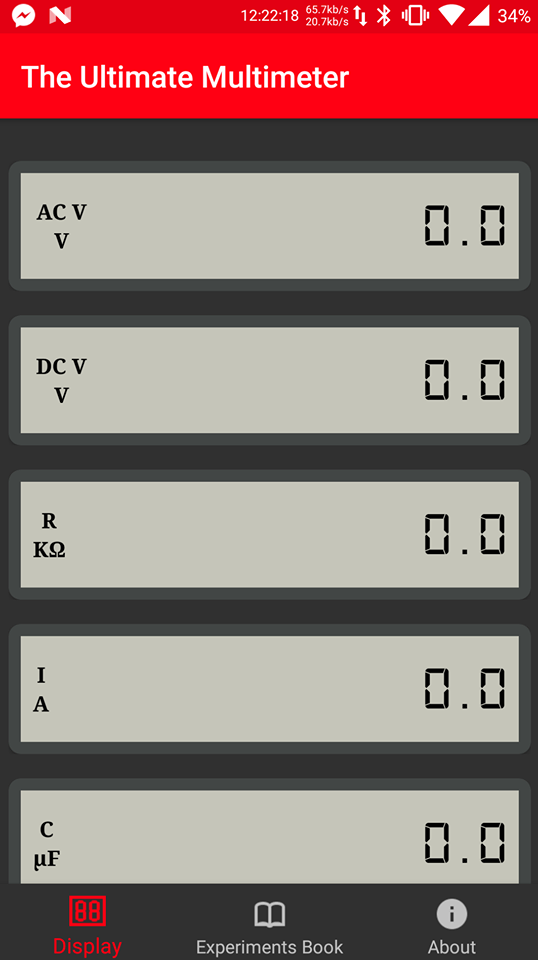
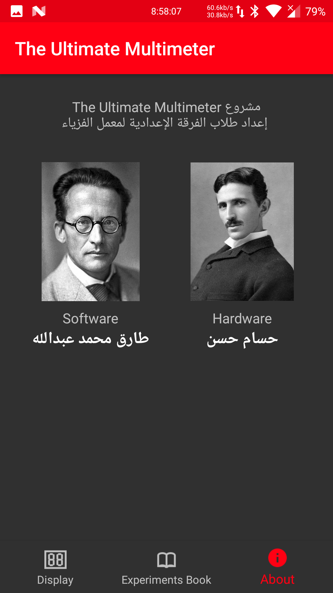
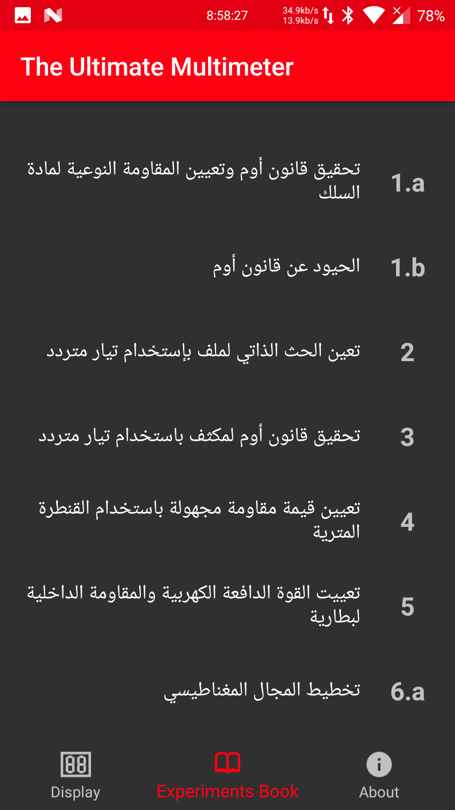
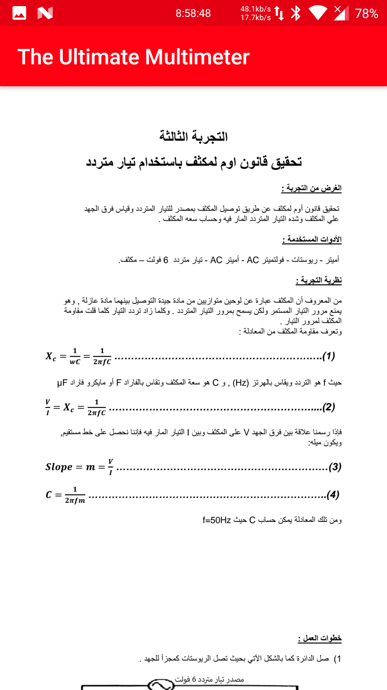

#### Details :
Number Base Converter :left_right_arrow: a small c++ program to convert any base to another.

#### Usage & Syntax :
Enter the number you wish to convert followed by its base, then enter the desired base.    
**Example :**
Convert 101 from binary to decimal.
```
Convert : 101 2
to base :10
{101}2 = {5}10 = {5}10
```

#### How does it work :


#### GitHub Repository :heart: :
<blockquote class="embedly-card"><h4><a href="https://github.com/TarekkMA/number_base_converter/blob/master/main.cpp">TarekkMA/number_base_converter</a></h4><p>Contribute to number_base_converter development by creating an account on GitHub.</p></blockquote>
<script async src="//cdn.embedly.com/widgets/platform.js" charset="UTF-8"></script>
